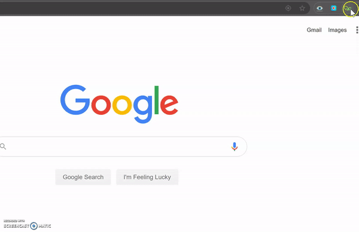

# gr8tful

## About
Gr8tful is a chrome extension that enables people to practice gratitude. [Why?](https://www.health.harvard.edu/newsletter_article/in-praise-of-gratitude)

## Demo
Extension:

## Built with
- Angular
- NodeJS
- MongoDB

BaseUrl = `https://gr8tfl.herokuapp.com/api`

## Installation

Run `ng build` to build the project. The build artifacts will be stored in the `dist/` directory. Use the `--prod` flag for a production build.

## Running unit tests

Run `ng test` to execute the unit tests via [Karma](https://karma-runner.github.io).

## Running end-to-end tests

Run `ng e2e` to execute the end-to-end tests via [Protractor](http://www.protractortest.org/).

## Further help

To get more help on the Angular CLI use `ng help` or go check out the [Angular CLI README](https://github.com/angular/angular-cli/blob/master/README.md).
